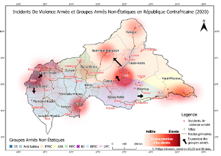
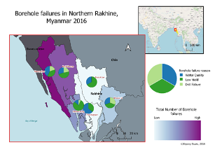
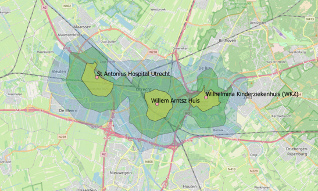

---
# Feel free to add content and custom Front Matter to this file.
# To modify the layout, see https://jekyllrb.com/docs/themes/#overriding-theme-defaults

layout: home
title: Bryony Essex
subtitle: Portfolio
---

{: style="clear: both;"}
{: style="float: left"}
Creation of a map for a security consultant.
Created using QGIS, with input data from ACLED and UN data.

{: style="clear: both;"}
{: style="float: left"}
Working on a project for Geology for Global Development NGO. Handwritten borehole data was digitized to analyse the risk of arsenic contamination in the water source.

{: style="clear: both"}
{: style="float: left"}
Isochrone mapping to for a UK transport consultancy. Using Isochrones to analyse hospital accessibility.
